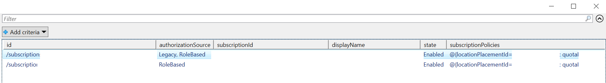

This section covers the supported options to help customize and automate scans for Azure environments. General options include:

 ```--Analysis```

Select the Azure resources used to gather data. Valid values are:

| Resource        | Value         |
| --------------- |:-------------|
| Databases       | Retrieves information from Azure databases, such as Azure SQL, Azure PostgreSQL or MariaDB |
| virtualmachines | Retrieves information from Azure virtual machines |
| SecurityAlerts | Retrieves information from security alers      |
| StorageAccounts | Retrieves information from storage accounts      |
| SecurityBaseline | Retrieves information from virtual machine's security baseline      |
| MissingPatches | Retrieves information from potentially virtual machine's missing patches      |
| SecurityPolicies | Retrieves information from security policy      |
| AppServices | Retrieves information from App Services      |
| KeyVaults | Retrieves information from Azure KeyVaults      |
| roleassignments | Retrieves information from Azure RBAC      |
| SecurityContacts | Retrieves information from Security Contacts      |
| All | Retrieves all metadata from Azure subscription      |

## Subscriptions

By default, Monkey365 will show the subscriptions to which the provided identity have access to. A user can select all the subscriptions to which the provided identity have access.




The ```-subscriptions``` option can be used to scan a number of subscriptions in one execution.

``` powershell
$param = @{
    Instance = 'Azure';
    Analysis = 'All';
    PromptBehavior = 'SelectAccount';
    subscriptions = '00000000-0000-0000-0000-000000000000 11111111-1111-1111-1111-111111111111';
    TenantID = '00000000-0000-0000-0000-000000000000';
    ExportTo = 'PRINT';
}
$assets = Invoke-Monkey365 @param
```

The ```-all_subscriptions``` option can be used to scan all the subscriptions.

``` powershell
$param = @{
    Instance = 'Azure';
    Analysis = 'All';
    PromptBehavior = 'SelectAccount';
    all_subscriptions = $true;
    TenantID = '00000000-0000-0000-0000-000000000000';
    ExportTo = 'PRINT';
}
$assets = Invoke-Monkey365 @param
```

## Exclude azure resources from scans

To ensure that all Azure resources are scanned, we recommend creating exclusions only when it is absolutely necessary. However, there are situations in which you may need to exclude an specific Azure resource, for example a Virtual Machine that is controlled by a third party integrations. 

The ```-ExcludedResources``` option can be used to exclude unwanted azure resources from being scanned.

``` powershell
$param = @{
    Instance = 'Azure';
    Analysis = 'All';
    PromptBehavior = 'SelectAccount';
    all_subscriptions = $true;
    TenantID = '00000000-0000-0000-0000-000000000000';
	ExcludedResources = 'C:\temp\az_excluded_resources.json';
    ExportTo = 'HTML';
}
Invoke-Monkey365 @param
```

This parameter only accepts a JSON file path. This JSON file must have the following structure:

``` json
{
    "title": "Azure exclusion list",
    "exclusions": [
        {
            "code": "Exclusion title",
            "suppress": {
                "pattern": "*mypattern*",
                "justification": "Justification text"
            }
        }
    ]
}
```

Consider the following example of a JSON exclusion file to understand how to use the ```ExcludedResources``` feature:

``` json
{
    "title": "Azure exclusion list",
    "exclusions": [
        {
            "code": "Azure VMs",
            "suppress": {
                "pattern": "*excludedmachine*",
                "justification": "Controlled by Third-Party integrations"
            }
        },
		{
            "code": "Azure Storage account",
            "suppress": {
                "pattern": "*excludedstorageaccount*",
                "justification": "Controlled by Third-Party integrations"
            }
        },
		{
            "code": "Azure Resource Group",
            "suppress": {
                "pattern": "*resourceGroups/excludedrg*",
                "justification": "Controlled by Third-Party integrations"
            }
        },
		{
            "code": "Azure Containers",
            "suppress": {
                "pattern": "*resourceGroups/Containers*",
                "justification": "Controlled by Third-Party integrations"
            }
        }
    ]
}

```