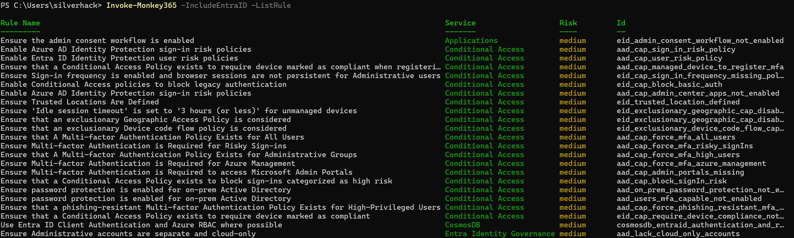

Monkey365 supports many options to help customize and automate scans. General options include:

```-Environment```

It can be used to set the environment containing the Azure account. Valid values are:

* AzureChina
* AzurePublic
* AzureUSGovernment

**Note**: Default value is ```AzurePublic```

 ```-Instance```

Specifies the cloud provider to use. Valid values are:

* Azure
* Microsoft365

 ```-TenantID```

It can be used to force Monkey365 to sign in to a tenant

```-IncludeEntraID```

Use this flag to scan a Microsoft Entra ID tenant:

``` powershell

$param = @{
    Instance = 'Microsoft365';
    Collect = 'ExchangeOnline';
    PromptBehavior = 'SelectAccount';
	IncludeEntraID = $true;
    ExportTo = 'HTML';
}
Invoke-Monkey365 @param
```

```-SaveProject```

Saves project to a local folder (Default folder is monkey-reports)

```-Compress```

This flag will compress all the output data into a single zip file (Default folder is monkey-reports\GUID\zip)

``` powershell

Invoke-Monkey365 -Instance Microsoft365 -Collect ExchangeOnline -ExportTo HTML -Compress

```

```-ImportJob```

Import previously exported jobs

```-PromptBehavior```

Sets the behavior for authentication. Valid values are ```ForceLogin```, ```Never```, ```NoPrompt``` and ```SelectAccount```

```-ForceAuth```

Force the prompt behavior and user will be prompted for credentials. <br /> Same as ```-PromptBehavior ForceLogin```

```-ForceMSALDesktop```

force PowerShell 6 and higher to load .NET MSAL libraries instead of .NET core versions. <span style="color:red">*Only valid on Windows environments*</span>

```-RuleSet```

Specifies the path to JSON rules file.

```-ListFramework```

Use this flag to list available frameworks:

``` powershell
Invoke-Monkey365 -ListFramework
```

## Listing collectors

The `-ListCollector` flag is used to display a list of available collectors within Monkey365. Collectors are modular components that gather specific sets of data from cloud environments such as Azure, Microsoft 365, or Entra ID.
When this flag is set to `$true`, Monkey365 will return all collectors that match the specified parameters. If no additional matchers (like Collect or Instance) are provided, the command will return **all available collectors** for the selected instance.

This feature is useful for:

* Exploring available collectors before running a full scan
* Validating collector names for targeted data collection
* Troubleshooting or auditing collector configurations

<figure markdown="span">
  
  <figcaption>Monkey365: List collectors for SharePoint Online</figcaption>
</figure>

#### Example 1: List All Collectors for Azure

The following example will list all collectors available for the Azure instance.

``` powershell
$p = @{
    Instance = "Azure";
    ListCollector = $true
}
Invoke-Monkey365 @p
```

#### Example 2: List All Collectors for Microsoft 365

The following example will list all collectors available for the Microsoft 365 instance.

``` powershell
$p = @{
    Instance = "Microsoft365";
    ListCollector = $true
}
Invoke-Monkey365 @p
```

#### Example 3: List Collectors for SharePoint Online

The following example will list only the collectors related to SharePoint Online within the Microsoft 365 instance.

``` powershell
$p = @{
    Instance = "Microsoft365";
    Collect = 'SharePointOnline';
    ListCollector = $true
}
Invoke-Monkey365 @p
```

## Excluding collectors

```-ExcludeCollector```

This option can be used to exclude collectors from being executed. For example, there are situations when you may need to exclude an specific collector, for example in tenants with thousands of users/mailboxed, that would slow down the scan.

``` powershell
$param = @{
    Instance = 'Microsoft365';
    Collect = 'ExchangeOnline';
    PromptBehavior = 'SelectAccount';
    TenantID = '00000000-0000-0000-0000-000000000000';
	ExcludeCollector = exo0003, exo0004, exo0005;
    ExportTo = 'HTML';
}
Invoke-Monkey365 @param
```

## Listing Rules

The `-ListRule` flag is used to display a list of available rules within the Monkey365 framework. Rules are modular components that contain instructions designed to query cloud environments and to detect potential misconfigurations or security issues across:

* Azure
* Microsoft 365
* Entra ID

When this flag is set to `$true`, Monkey365 will return all rules that match the specified parameters. If no Instance is specified, the command will return **all available rules** across all supported platforms.

This feature is especially useful for:
* Exploring rule coverage before executing a scan
* Validating rule names for targeted analysis
* Auditing or customizing rule sets for compliance

<figure markdown="span">
  
  <figcaption>Monkey365: List rules for Entra ID</figcaption>
</figure>

#### Example 1: List All Rules for Azure

The following example will list all rules available for the Azure instance.

``` powershell
$p = @{
    Instance = "Azure";
    ListRule = $true
}
Invoke-Monkey365 @p
```

#### Example 2: List All Rules for Microsoft 365
The following example will list all rules available for the Microsoft 365 instance.

``` powershell
$p = @{
    Instance = "Microsoft365";
    ListRule = $true
}
Invoke-Monkey365 @p
```

#### Example 3: List Rules for Entra ID
The following example will list all rules related to Entra ID, included as part of the Microsoft 365 instance.

``` powershell
$p = @{
    Instance = "Microsoft365";
    IncludeEntraID = $true;
    ListRule = $true
}
Invoke-Monkey365 @p
```
