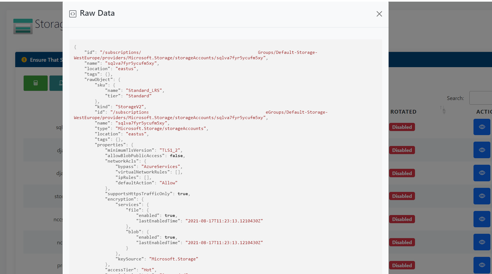

Monkey365 provides an internal module which provides methods to convert internal data to HTML format. Also, internal module adds additional support to Markdown syntax with <a href='https://github.com/xoofx/markdig' target='_blank'>Markdig</a>.


The following example can be used to export all data to an HTML file.

``` powershell
$param = @{
    Instance = 'Azure';
    Analysis = 'All';
    PromptBehavior = 'SelectAccount';
    all_subscriptions = $true;
    TenantID = '00000000-0000-0000-0000-000000000000';
    ExportTo = 'HTML';
}
$assets = Invoke-Monkey365 @param
```

## Customize HTML

A Monkey365 report uses JSON configuration files to visualize data in a variety of ways. This approach makes it easy to modify and combine tables, style them, and make them interactive with buttons. You can use your favorite text editor in order to modify these configuration files.

## HTML Configuration Files Location

All the table formats are stored under ```Monkey365/core/html/htmlconf```. Internal data is rendered with ```JQuery DataTables```. Basic table and table ```as list ``` are the available formats. Please, note that not all features of HTML tables are supported.

## HTML Table examples

### Table As List

For example, table elements for Azure app services can be formatted to display complex structured data in the ``app_services.json`` file.

``` json
{
	"app_service_missing_identity": [
        {
            "translate": {
                "name": "Application Name",
                "kind": "Kind",
                "location": "Location",
                "properties.defaultHostName": "HostName",
                "properties.httpsOnly": "Https Only",
                "identity.principalId": "Principal ID",
                "configuration.properties.ftpsState": "SSL FTP",
                "configuration.properties.minTlsVersion": "TLS Version",
                "configuration.properties.siteAuthSettings.Enabled": "Site Auth Enabled"
            },
            "table": "asList",
            "emphasis": ["Principal ID"]
        }
    ]
}
```

In the above example, this will result in the data being rendered in a single table formatted ```as list```.


### Normal Table

In this example, table elements for Storage accounts missing key rotation can be formatted to display complex structured data in the ``storage.json`` file.

``` json
{
	"storage_accounts_https_traffic_disabled": [
        {
            "translate": {
                "name": "Name",
                "CreationTime": "Creation Time",
                "location": "Location",
                "supportsHttpsTrafficOnly": "Https Only"
            },
            "table": "Normal"
        }
    ],
}
```
The above example will result in the data being rendered in a single table formatted as normal table.


### Add Raw data button

Table elements can be configured to show raw data on Bootstrap Modal. In order to route for showing raw data with modals, the ```showModalButton``` should be set to ```True```, as shown below:

``` json
{
	"storage_accounts_missing_key_rotation": [
        {
            "translate": {
                "name": "Name",
                "location": "Location",
                "ResourceGroupName": "ResourceGroupName",
				"isKeyRotated": "Key Rotated"
            },
            "table": "Normal",
			"actions":{
				"objectData":{
					"expand": ["*"],
					"format": "json"
				},
				"showGoToButton":"True",
				"showModalButton":"True"
			}
        }
    ]
}
```
The above example will result in the data being rendered in a single table formatted as normal table, and a modal button in last column.



**Note** This feature is only supported in tables formatted as a ```Normal``` table.

### Add direct link button

Table elements can be configured to add a direct link to the Azure console section associated with the finding in the report. In order to route for showing raw data with modals, the ```showGoToButton``` should be set to ```True``` along with the ```actions```, as shown below:

``` json
{
	"storage_accounts_missing_key_rotation": [
        {
            "translate": {
                "name": "Name",
                "location": "Location",
                "ResourceGroupName": "ResourceGroupName",
				"isKeyRotated": "Key Rotated"
            },
            "table": "Normal",
			"actions":{
				"objectData":{
					"expand": ["*"],
					"format": "json"
				},
				"showGoToButton":"True",
				"showModalButton":"True"
			}
        }
    ]
}
```
The above example will result in the data being rendered in a single table formatted as normal table, and a direct link button in last column.


**Note** This feature is only supported in tables formatted as a ```Normal``` table. Please, also note that since this feature is experimental, we welcome your feedback.