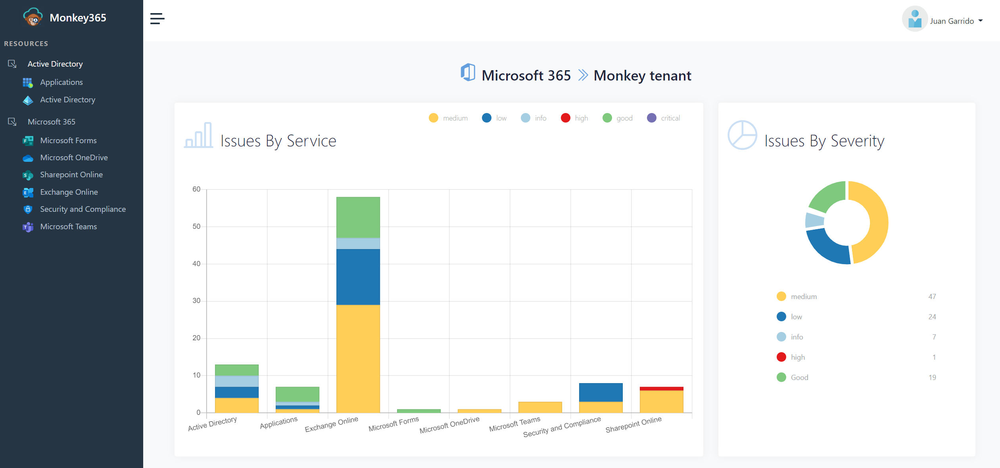

# Monkey365

Monkey365 is an Open Source security tool that can be used to easily conduct not only Microsoft 365, but also Azure subscriptions and Microsoft Entra ID security configuration reviews without the significant overhead of learning tool APIs or complex admin panels from the start.

Monkey365 has been designed to tackle these difficulties and get results fast and without any requirements. The results will be visualised in a simplified HTML report to quickly identify potential issues. As such, security consultants will be able to effectively address issues from a single vulnerability report.

To help with this effort, Monkey365 also provides several ways to identify security gaps in the desired tenant setup and configuration. Monkey365 provides valuable recommendations on how to best configure those settings to get the most out of your Microsoft 365 tenant or Azure subscription.

# Architecture

Monkey365 works in three phases. In the first phase, collectors will issue queries against the multiple data sources to retrieve the desired metadata about targeted tenant or subscription, and then will collect information. Once all the necessary metadata is collected, the result is passed to an internal module in order to start the verifying phase, in which the tool uses the data collected in first phase to perform query search with a default set of rules, as a mechanism to evaluate the configuration and to search for potential misconfigurations and security issues. The third phase starts to generate reports, such as an HTML report containing structured data for quick checking and verification of the results.

# Documentation

* [Getting Started](install-instructions)
* [License and Contributing](license-contributing)
* [Support](support)
* [Disclaimer](disclaimer)
* [Sample report](sample/Monkey365.html)