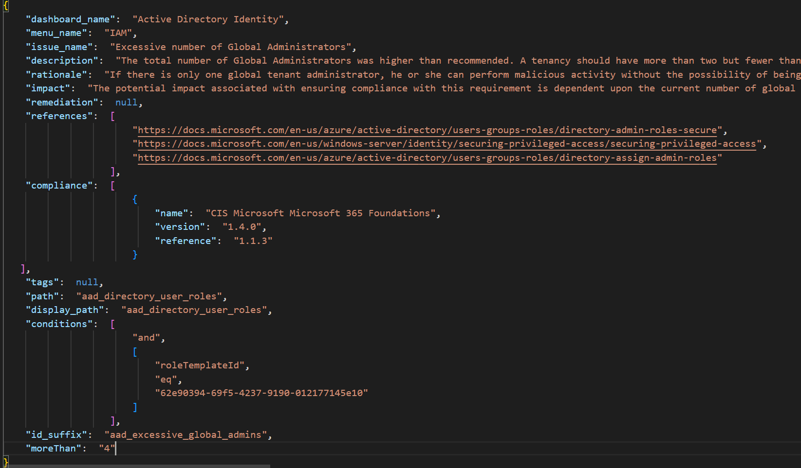

## Create a rule
Monkey365 enable users to create rules, both simple and complex, to tell Monkey365 which objects to check, the conditions to check, and the corresponding actions to perform when conditions occur. You can use Monkey365 to create rules for internal data objects piped to Monkey365 for validation.

## Rule Body

A rule is described in JSON. A single rule can be used to represent complex rules. A rule has an `issue_name` and a list of conditions that are evaluated when the rule is triggered.



## Scenario - Check for remote PowerShell enabled users

In this quickstart scenario, we have been tasked with creating a rule to check for the presence of remote PowerShell enabled users in Exchange Online. When a user with the ```RemotePowerShellEnabled``` enabled attribute is found the rule should fail.

To check the remote PowerShell access status for users, create a JSON rule with the following contents. This file can be created in any text editor, such as Notepad++ or Visual Studio Code. Please, note that you must save the new rule at ```$monkey365_DIR/rules/findings``` directory. 

``` json 
{
    "dashboard_name": "Exchange Online",
    "menu_name": "Microsoft 365",
    "issue_name": "Exchange Online Remote PowerShell Access Enabled",
    "description": "It was possible for users to access the Exchange Online Remote PowerShell on the Microsoft 365 environment.",
    "references": [
        "https://docs.microsoft.com/en-us/powershell/exchange/disable-access-to-exchange-online-powershell?view=exchange-ps"
    ],
    "compliance": [
        [
            "Monkey365 rule"
        ]
    ],
    "path": "o365_exo_users",
    "display_path": "o365_exo_users",
    "conditions": [
        "and",
        [
            "RemotePowerShellEnabled",
            "ne",
            "False"
        ]
    ],
    "id_suffix": "o365_exo_users_remote_ps_enabled"
}

```

1.- ```dashboard_name```: This is the friendly name of the application/service that is checked, displayed on the HTML dashboard.

2.- ```menu_name```: This is the friendly name of the provider, which is displayed on the HTML sidebar.

3.- ```issue_name```: The rule name.

4.- ```description```: The rule description. Rule description supports <a href='https://en.wikipedia.org/wiki/Markdown' target='_blank'>Markdown</a>. That way you can add links and apply minor text styles.

5.- ```references```: This parameter is optional. You can add external links in order to help consultants find more information about findings. Result output will sometimes be more than enough to explain what the issue is, but it can also be beneficial to explain why an issue exists, and this is a great place to do that. Additional elements such as remediation or rationale can be added to existing JSON rule. Both of them supports <a href='https://en.wikipedia.org/wiki/Markdown' target='_blank'>Markdown</a>.

6.- The ```condition``` property determines the checks Monkey365 will use to test each user returned in Exchange Online. Specifically, the ```RemotePowerShellEnabled``` property of each user object will be evaluated. The value of ```RemotePowerShellEnabled``` should not be *False*. Multiple PowerShell comparison operators are supported. The following <a href='https://learn.microsoft.com/en-us/powershell/module/microsoft.powershell.core/about/about_comparison_operators?view=powershell-7.2' target='_blank'>link</a> is a list of comparison operators supported by PowerShell. 

7.- Name your rule with a unique name .Json.

## Testing rules

You can either create a new JSON ruleset from scratch or edit an existing one and add your custom rule. The following is an example of a custom ruleset with one rule. 

``` json
{
    "about": "My custom ruleset",
	"rules": {
		"exchange-users-remote-powershell-enabled.json": [
            {
                "enabled": true,
                "level": "medium"
            }
        ]
    }
}
```

If users with remote PowerShell session are discovered, results will be displayed in the HTML report, as shown below:


You can customize HTML tables in order to visualize data in a variety of ways. More information about how to customize data can be found [here](../../exporting/export-html/).