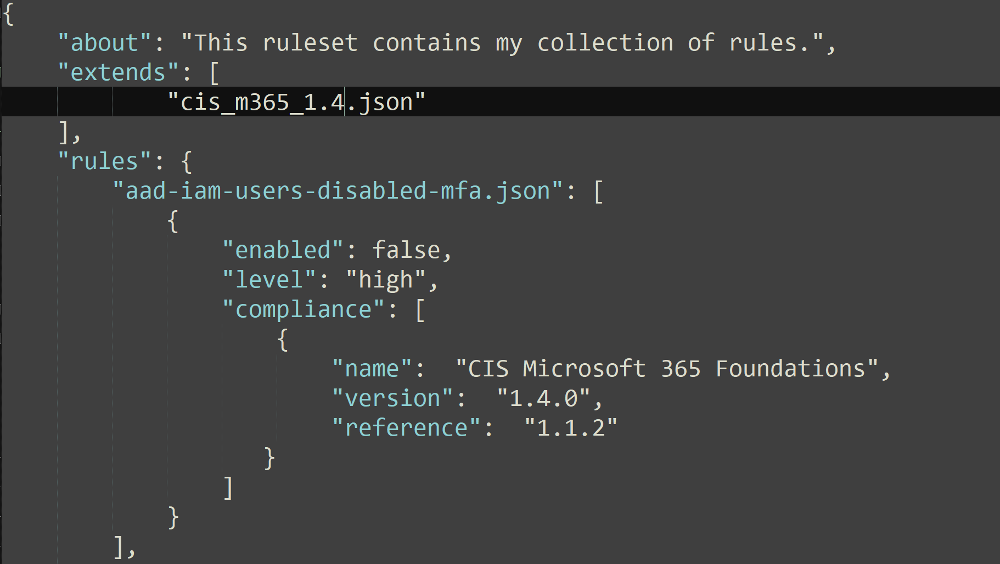

## Custom rulesets
Customizing existing rulesets for Azure or Microsoft 365 might be all you need at first, but at some point, you will want to make a custom ruleset. For example, the CIS Benchmark rulesets help check for recommended hardening policies and best practices, but you could create a custom ruleset to be used for analyzing an specific tenant or subscription. With this approach you can ignore specific rules you want and set the desired severity of these rules.

You can either create a new JSON ruleset from scratch or edit an existing one. We recommend starting by editing an existing ruleset so that you have the base structure already in place. Later on, you can create a new ruleset from the beginning.

## Adding rules
Add your own rules under the ```rules``` property in your JSON rule file.


## level

The ```level``` keyword is optional and can be critical, high, medium, low, or info.

If not set, the default value is info.

## Disabling Rules
There are situations in which you might want to enable all rules by default, and disable a few. The ```enabled``` keyword is mandatory and can be ```true```, or ```false```.


## Extending Rules
In some cases you might want to apply a limited number of rules from another ruleset. To do this, use the ```extends``` property with the path of the ruleset. This will load rules from the extended ruleset.


## Overrides
To customize the behavior of an specific rule, you can override the ruleset at deployment. When you override a rule you specify changes to be modified on top of the default ruleset. These changes will take precedence over the rule’s default behavior.

### Working with overrides
You can override a rule at various levels:

* args
* level
* enabled/disabled rule
* compliance

For example overrides provide a way to replace the compliance value in your rule with another version.


Some of existing rules may require parameters, such as port, UUID, etc.. This rule definition can be referenced multiple times in the custom ruleset, and some of its values overridden by the ruleset. 


### Run Monkey365 with the new ruleset

After you have finished creating the ruleset file, you will need to use the ```RuleSet``` parameter to load the ruleset, as shown below:

``` powershell
$param = @{
    Instance = 'Microsoft365';
    Collect = 'ExchangeOnline';
    PromptBehavior = 'SelectAccount';
    TenantID = '00000000-0000-0000-0000-000000000000';
	RuleSet = C:\temp\myruleset.json;
    ExportTo = 'HTML';
}
Invoke-Monkey365 @param
```
You may want to use the previously created ruleset with saved projects. The following example shows how to use ImportJob and the RuleSet options:

``` powershell
$param = @{
    ImportJob = $True;
	RuleSet = C:\temp\myruleset.json;
    ExportTo = 'HTML';
}
Invoke-Monkey365 @param
```